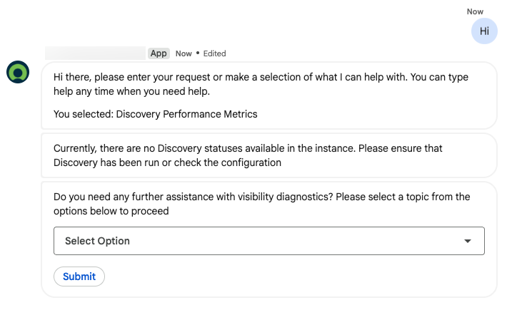

# Google Chat to ServiceNow Virtual Agent Integration

## What This Is
Google Chat bot connected to ServiceNow Virtual Agent using the **native `sn_va_google_chat` plugin** and the **Now Virtual Agent** Marketplace app.

---

## Prerequisites (done once, do not redo)

### 1. Google Workspace Domain
- Domain: `<YOUR_WORKSPACE_DOMAIN>` (Google Workspace, NOT a personal Gmail)
- Admin: `<WORKSPACE_ADMIN_EMAIL>`
- **Why Workspace matters:** Personal Gmail GCP projects lock "Build as Workspace add-on" permanently ON and use a different service account format. A paid Workspace account is required for the self-configured bot path.

### 2. GCP Project
- Project: `<GCP_PROJECT_ID>` (project number `<GCP_PROJECT_NUMBER>`)
- Owner: `<WORKSPACE_ADMIN_EMAIL>`
- APIs enabled:
  - **Google Chat API**
  - **Google Workspace Add-ons API** (creates the inbound service account automatically)

### 3. GCP Chat API Configuration
Navigate: `https://console.cloud.google.com/apis/api/chat.googleapis.com/hangouts-chat?project=<GCP_PROJECT_ID>`

| Setting | Value |
|---------|-------|
| App status | LIVE |
| App name | `<YOUR_BOT_NAME>` |
| **Build as Workspace add-on** | **CHECKED** (mandatory, the native SN plugin expects this) |
| Connection | HTTP endpoint URL |
| HTTP endpoint URL | `https://<INSTANCE>.service-now.com/api/sn_va_google_chat/va_google_chat_inbound/events` |
| Triggers | Use a common HTTP endpoint URL for all triggers |
| Service account email | `service-<GCP_PROJECT_NUMBER>@gcp-sa-gsuiteaddons.iam.gserviceaccount.com` |

### 4. GCP Service Accounts
| Purpose | Email |
|---------|-------|
| Inbound (Google to SN) | `service-<GCP_PROJECT_NUMBER>@gcp-sa-gsuiteaddons.iam.gserviceaccount.com` |
| Outbound (SN to Google) | `<OUTBOUND_SA>@<GCP_PROJECT_ID>.iam.gserviceaccount.com` |

### 5. Outbound P12 Key
- File: `<YOUR_P12_FILE>.p12`
- Password: `<P12_PASSWORD>`
- Uploaded to SN as attachment, sys_id: `<P12_ATTACHMENT_SYS_ID>`
- Used for JWT-signed outbound calls to `chat.googleapis.com`

---

## ServiceNow Configuration

### Plugin
- `sn_va_google_chat` - Conversational Integration with Google Chat (pre-installed on instance)

### Bot Installation
Run once via the native API:
```
GET /api/sn_va_google_chat/multi_instance_google_chat_bot_ui/installGoogleChatCustomBot
  /{bot_name}
  /{inbound_service_account_email}
  /{outbound_service_account_email}
  /{private_key_password}
  /{p12_attachment_sys_id}
  /{isUpdate}
```

Example call:
```
/installGoogleChatCustomBot
  /<BOT_NAME>
  /service-<PROJECT_NUMBER>%40gcp-sa-gsuiteaddons.iam.gserviceaccount.com
  /<OUTBOUND_SA>%40<PROJECT_ID>.iam.gserviceaccount.com
  /<P12_PASSWORD>
  /<P12_ATTACHMENT_SYS_ID>
  /false
```

This API creates all required records automatically:
- `sys_cs_provider_application` (bot identity)
- `provider_auth` (inbound JWT validation)
- `oauth_oidc_entity` (OIDC token verification)
- `oidc_provider_configuration` (issuer: `https://accounts.google.com`)
- `oauth_entity` (outbound OAuth provider)
- `jwt_provider` + `jwt_keystore_aliases` (outbound JWT signing)
- `sys_certificate` (P12 keystore)

**If reinstalling:** delete ALL of these records first. The API returns conflicts like "bot already exists" or "failed to create outbound keystore alias" if leftovers exist.

### Key SN Record sys_ids
| Record | Table | sys_id |
|--------|-------|--------|
| VA Google Chat Provider | `sys_cs_provider` | *(query by name)* |
| Google Chat Channel | `sys_cs_channel` | *(query by name)* |
| P12 Attachment | `sys_attachment` | *(uploaded during setup)* |

### Topic Configuration
For a topic to work via Google Chat for unauthenticated (Guest) users:

1. **Roles must include `public`** - set on BOTH `sys_cs_topic.roles` AND `sys_cb_topic.roles`
2. **Republish the topic** from VA Designer after changing roles. The `published_definition` JSON blob is a snapshot regenerated only on publish. REST/GlideRecord writes to the topic record do NOT update it.
3. Topic must be `active=true`, `published=true`, `discoverable=true`
4. `model_type=nlu_keyword` enables both NLU and keyword matching

### Account Linking (Guest to SN User)
The native adapter creates Guest consumers by default. The `sys_cs_channel_user_profile` and `sys_cs_consumer` records need the `user` field set to link to an SN user.

**Critical:** REST Table API writes to `sn_cs` scoped tables are **silently stripped**. To write these fields, create a temporary `sys_ws_operation` under the `sn_va_google_chat` scoped API (find the `sys_ws_definition` for `va_google_chat_inbound`), run a GlideRecord update from that scope, then delete the temp operation.

---

## Debugging

### Do
- Use VA Designer **Test tool** for topic/NLU testing (channel-agnostic, instant)
- Check `open_nlu_predict_log` for NLU prediction results (model, confidence, utterance)
- Check `sys_cs_conversation` filtered by `device_type=Google Chat` for conversation state
- Use `va_gchat_debug_log` system property for custom debug logging

### Do NOT
- **NEVER** query `syslog` / `sys_log` - it freezes the instance
- Don't guess table names - verify with `sys_db_object` first
- Don't chase language issues (disproven: NLU runs with `language=en`)
- Don't try to write `published_definition` directly - it's computed on publish

### Common Issues
| Symptom | Cause | Fix |
|---------|-------|-----|
| "I didn't understand" despite NLU match | `published_definition.roles` doesn't include `public` | Republish topic from VA Designer |
| No NLU prediction logged | Context profile forces wrong `model_type` | Check `sys_cs_context_profile` order/conditions |
| REST writes silently fail | Scoped table protection | Use GlideRecord via scoped scripted REST op |
| `installGoogleChatCustomBot` errors | Leftover records from previous install | Delete all related oauth/oidc/jwt/provider records first |
| "not responding" in Google Chat | Add-on checkbox unchecked in GCP | Check "Build as Workspace add-on" in GCP Chat API config |

---

## Custom Objects (deactivated, native stack replaces these)
These were part of the original custom integration and are now **inactive**:

| Object | sys_id | Status |
|--------|--------|--------|
| Custom inbound endpoint | *(search sys_ws_operation)* | **Inactive** |
| Outbound delivery BR | *(search sys_script)* | **Inactive** |
| Script actions (send_message) | *(search sysevent_script_action)* | **Inactive** |
| NLU-Keyword context profile | *(search sys_cs_context_profile)* | **Inactive** |

Do NOT reactivate these unless reverting to the custom stack.

### Backup
Full backup of pre-pivot configuration: `../backup-marketplace-pivot/`
Restore script: `../backup-marketplace-pivot/RESTORE.sh`

---

## Instance
Configure your instance URL and credentials in a `.env` file (not committed).

---

## Result



Google Chat successfully triggers the **Discovery Performance Metrics** VA topic. The bot presents the topic flow with interactive dropdowns and submit buttons rendered natively in Google Chat.
